# Azure Key Vault — Secrets, Keys & Certificate Governance

**Least-privilege, HIPAA-aligned secrets management for a regulated healthcare network — built on Azure RBAC data-plane access, PIM just-in-time privileged access, HSM-protected keys, native rotation, and validated backup/recovery.**

> Project scenario: **Meridian Health Partners (MHP)** — a ~520-employee regional healthcare network governed by **HIPAA**, **NIST SP 800-53**, and **ISO 27001**. This build secures the three classes of sensitive material an IAM function is accountable for: an application credential, a cryptographic key that protects PHI at rest, and a TLS certificate for a patient-facing service — each under explicit, auditable, least-privilege control.

Tenant: `isaiahherard26gmail.onmicrosoft.com` · Vault: `kv-meridian-health-01` (Premium) · Region: Central US

---

## Why this project matters (IAM / PAM / PIM value)

Key Vault is where identity governance stops being about *people* and starts being about **secrets, machine identities, and non-human credentials** — the material that applications and services use to authenticate to each other. Securing it is a Privileged Access Management problem wearing an Azure-native costume: *who (and what) can read a secret, under what conditions, with what audit trail, and for how long.*

This build demonstrates that end to end, and every design decision is tied to a real compliance or operational driver:

- **Access is governed by Azure RBAC on the data plane, not legacy access policies** — enabling per-object least privilege and closing a real privilege-escalation gap. This is a **separation-of-duties (SoD)** control.
- **Privileged cryptographic access is just-in-time via Microsoft Entra PIM** — the Crypto Officer role is *eligible*, not standing. This is the **zero-standing-privilege** principle that sits at the heart of modern PAM.
- **The PHI encryption key is HSM-protected** (FIPS 140-2 Level 2), with the Level 2 vs Level 3 cost/assurance tradeoff documented rather than hidden.
- **Rotation is handled correctly per object type** — native for keys and certificates, event-driven orchestration for secrets — with the enforcement boundary stated plainly.
- **Durability controls (soft-delete + purge protection) are validated, not assumed** — proven by attempting a purge and capturing the block.

---

## Architecture decisions

### 1. Azure RBAC over access policies (the core IAM decision)

The vault uses the **Azure role-based access control (RBAC)** permission model on the data plane, not the legacy vault access-policy model. As of Key Vault API version `2026-02-01`, RBAC is also the Microsoft-recommended default for new vaults. The rationale:

- **Per-object least privilege.** Access policies are all-or-nothing at the vault: grant "get secrets" and a principal can read *every* secret. RBAC scopes a role to an *individual* secret, key, or certificate.
- **Closes a privilege-escalation gap (SoD).** Under access policies, anyone with `Contributor` or `Key Vault Contributor` can edit the access policy and grant *themselves* data-plane access. RBAC restricts that right to `Owner` / `User Access Administrator`, separating "manage the resource" from "read its contents."
- **PIM integration.** RBAC role assignments can be made *eligible* rather than permanent, enabling just-in-time activation with approval, justification, and automatic expiry.

### 2. Premium SKU (immutable — chosen deliberately)

Premium was selected so a single vault could demonstrate **HSM-protected keys** (objective #2). The pricing tier is immutable after creation; see *What Broke #2*.

### 3. Least-privilege persona model

Roles are assigned to real seated identities in the tenant, each scoped to exactly what the persona's function requires. The break-glass admin account is excluded from all standing assignments.

| Persona | Role | Scope | Rationale |
|---|---|---|---|
| **Priya Sharma** (IAM Analyst) | Key Vault Reader | Vault | Sees that objects exist and audits configuration — **cannot read secret values**. |
| **Jennifer Williams** (Identity Ops Lead) | Key Vault Administrator | Vault | Full data-plane management of keys/secrets/certs. |
| **Thomas Mitchell** (Security Engineer) | Key Vault Crypto Officer | Vault | **PIM-eligible (JIT only)** — zero standing privilege over cryptographic material. |
| **Robert Kim** (Sr. Systems Admin) | Key Vault Secrets User | **Single secret** (`ehr-db-connection`) | Object-scoped runtime read of exactly one secret — nothing else in the vault. |
| `meridian-admin` | *none* | — | Break-glass only; excluded from all standing assignments. |

The three-scope contrast — **metadata-only (Priya)**, **full management (Jennifer)**, **one secret's value (Robert)** — is the least-privilege model demonstrated concretely.

---

## Build walkthrough

### Objective 1 — Deploy Key Vault & configure settings

A dedicated resource group (`rg-meridian-keyvault`) isolates the project for clean governance and one-click teardown.

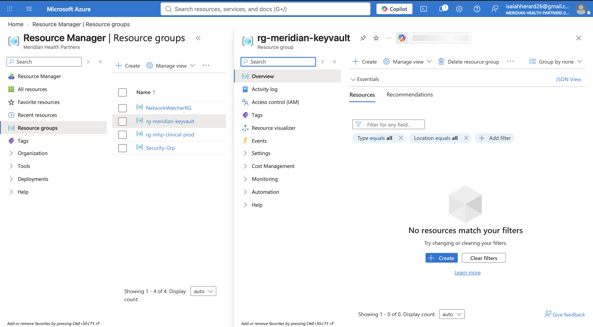

The vault was configured on the Basics tab as **Premium**, with **soft-delete** (90-day retention) and **purge protection** enabled — the durability backstop validated in objective #6.

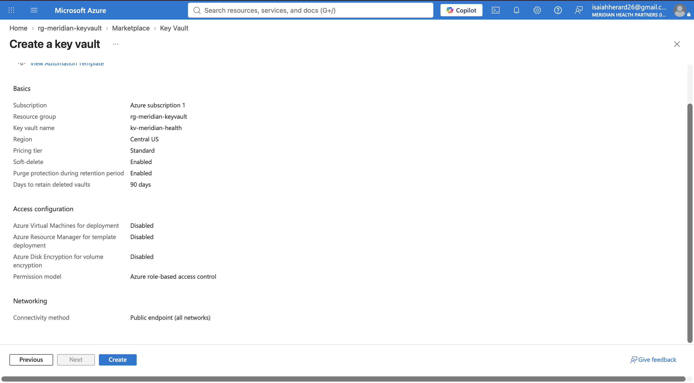

### Objective 2 — Key Vault security with HSMs

The PHI-at-rest encryption key (`phi-encryption-key`) was generated as an **RSA-HSM** key. Generating in-HSM means the private key material is *born* inside the hardware module and is non-exportable.

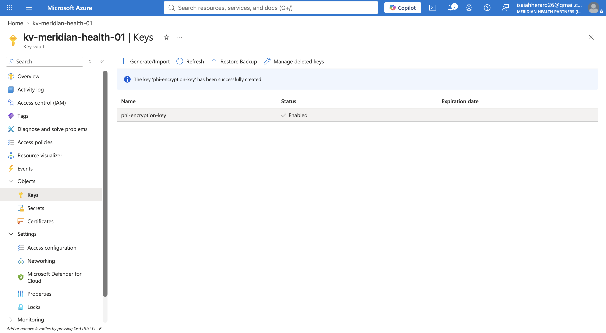

**Honest boundary — FIPS Level 2 vs Level 3.** Premium-vault HSM keys are **FIPS 140-2 Level 2** validated (multi-tenant HSM). The Level 3 answer is **Azure Managed HSM** (single-tenant, dedicated pool), which runs **~$2,300+/month**. For a $0-budget lab, Premium HSM keys are the correct choice; Managed HSM is documented as the production enterprise option rather than built. Knowing where that line sits — and why — is the point.

### Objective 3 — Configure access to Key Vault

Access is governed by the RBAC model set at deployment.

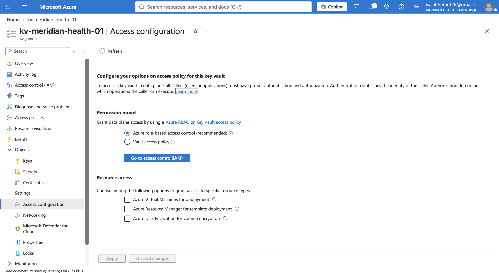

Personas are real users in the tenant directory:

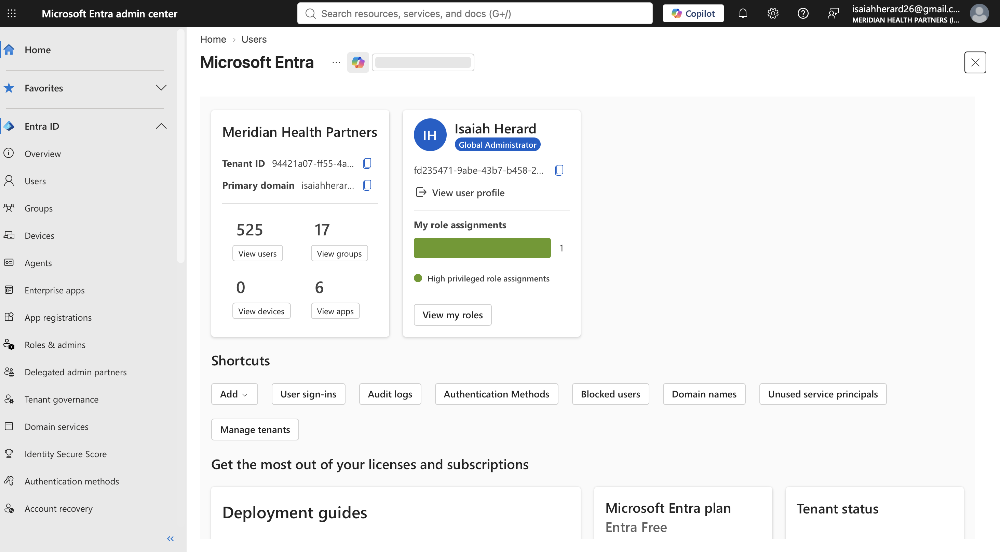

**Vault-scoped assignments** (oversight roles that legitimately need whole-vault visibility):

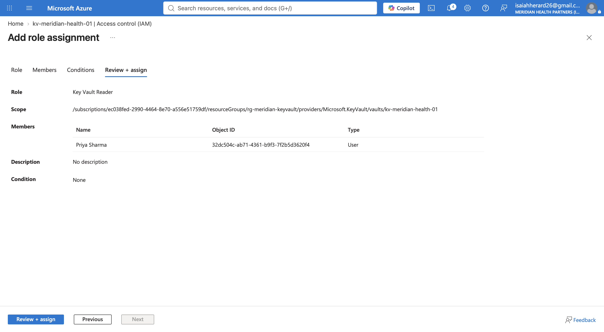

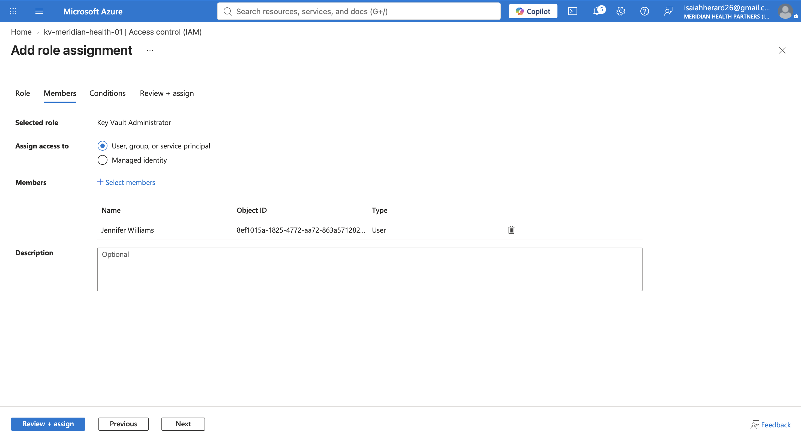

**Object-scoped assignment** — the cleanest least-privilege artifact. Robert receives **Key Vault Secrets User scoped to `ehr-db-connection` only**, assigned on the secret's *own* Access control (IAM) blade — not the vault's:

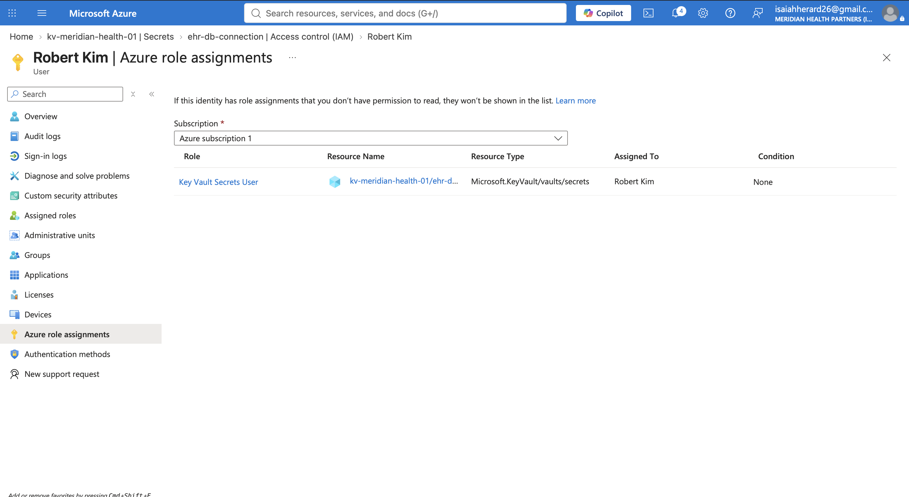

#### Privileged access: PIM just-in-time (the PAM centerpiece)

Thomas's Crypto Officer role — the powerful role that can create, rotate, and delete keys — is assigned as **Eligible** through Microsoft Entra PIM. He holds **zero standing privilege** until he activates it on demand.

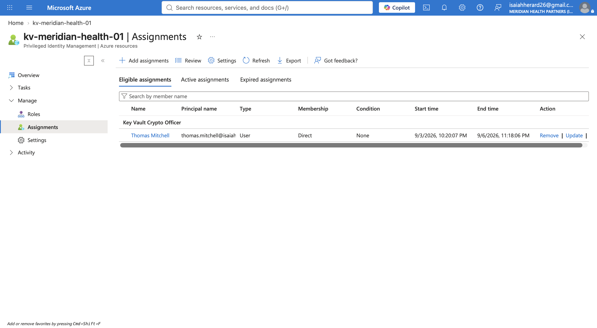

Activation requires a **justification** and is time-boxed, producing a full audit record of *who* elevated, *when*, *why*, and *for how long*:

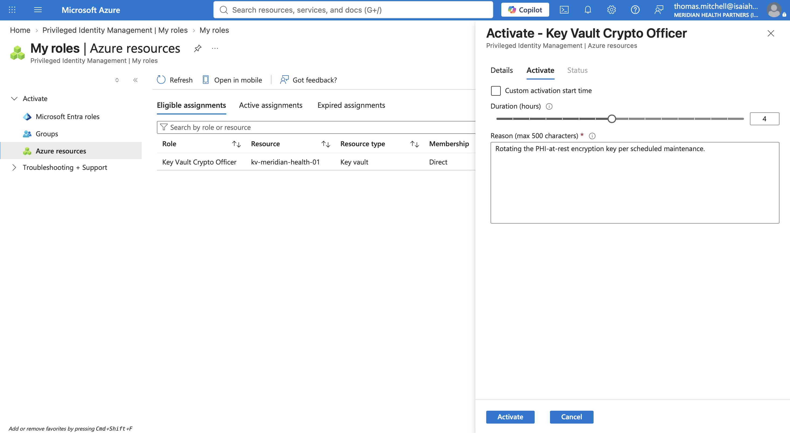

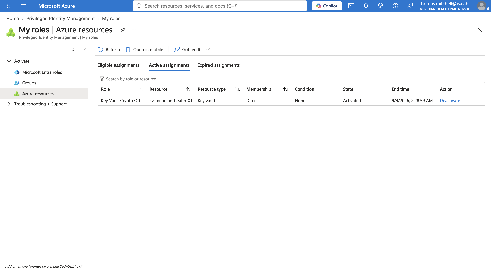

After validation, the role was returned to eligible-only, restoring zero standing privilege. **This is the direct Azure-native analog of a PAM credential-checkout / just-in-time elevation workflow** — the model that eliminates always-on administrative access as an attack surface.

> **Note on licensing (honest boundary):** PIM requires Microsoft Entra ID P2. The tenant's one free P2 trial was already consumed, so this was built on a single purchased P2 license assigned to the eligible principal — the minimum needed to demonstrate the control live.

### Objective 4 — Manage keys, secrets & certificates

The vault holds the three canonical object classes, each tied to a real MHP system.

**Secret** — the EHR database connection string. Values are synthetic by discipline: the vault's contents are the sensitive material, so lab objects never contain real credentials (the screenshots themselves must never leak).

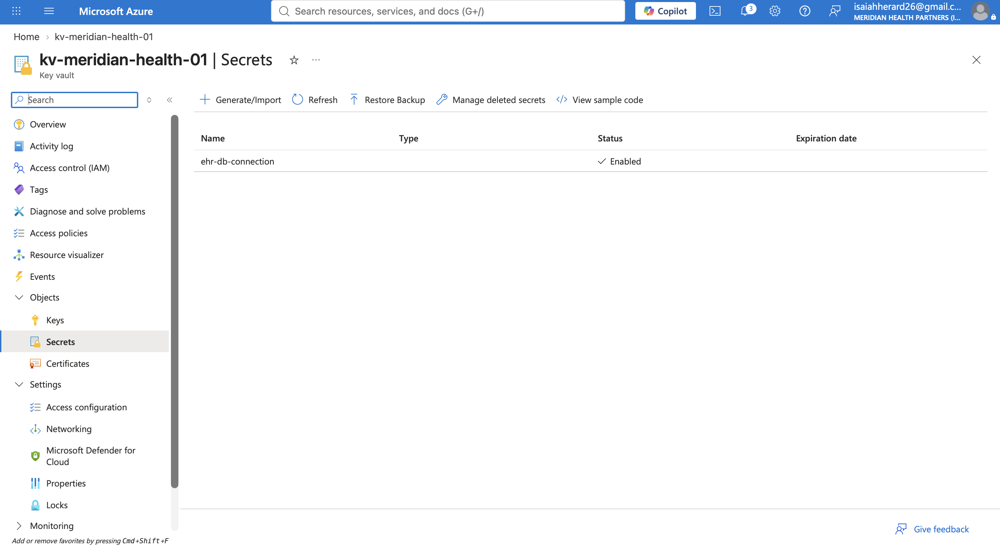

**Key** — the HSM-protected PHI encryption key (see objective #2, screenshot 15).

**Certificate** — the patient-portal TLS certificate (`patient-portal-tls`), self-signed for the lab. The Key Vault certificate lifecycle (generation, storage, renewal policy) is identical whether self-signed or CA-issued; production MHP would integrate a public CA.

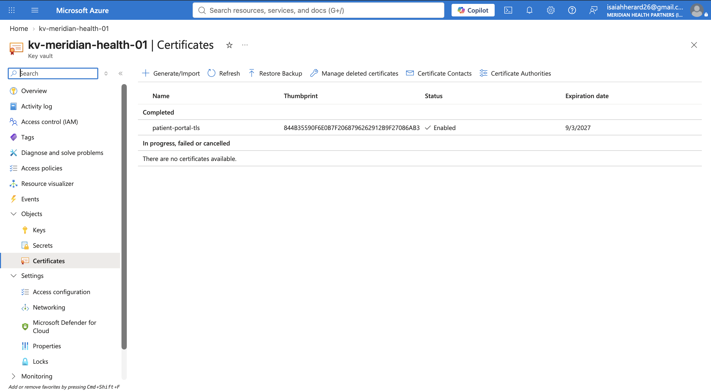

### Objective 5 — Configure key rotation

Rotation is handled **per object type**, and the differences are the substance of this objective.

**Keys — native auto-rotation.** A rotation policy on `phi-encryption-key` rotates key material automatically, bounding the blast radius of any key compromise.

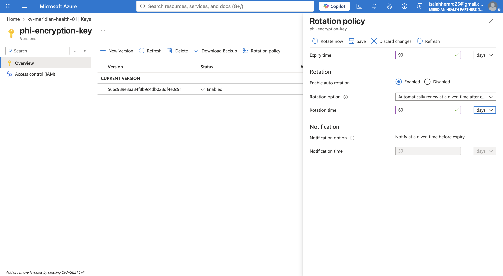

**Certificates — native auto-renewal.** A lifetime action auto-renews `patient-portal-tls` at 80% of its validity, removing the classic "expired cert took the portal offline" failure mode.

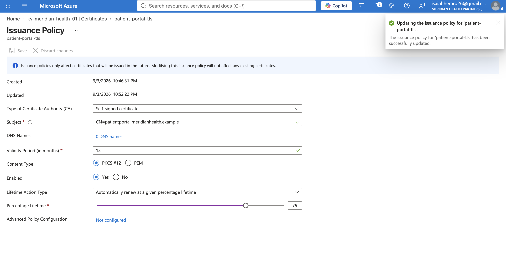

**Secrets — no native credential rotation (the honest wall).** Key Vault cannot rotate a secret's underlying credential, because it stores the object but does not own the downstream system the secret authenticates to. Rotation must be *orchestrated*: a near-expiry event routes through Event Grid to an Azure Function that rotates the credential in the target system and writes the new version back to the vault.

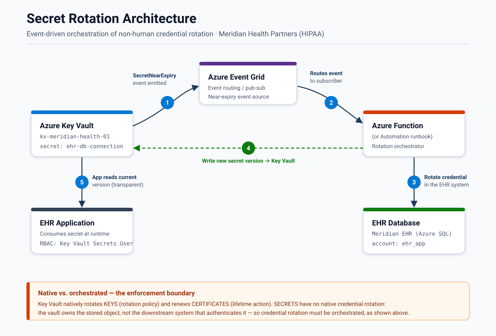

This seam — where secrets *management* becomes secrets *orchestration* — is precisely where Azure-native tooling hands off to dedicated PAM platforms (e.g., CyberArk's rotation engines). Knowing exactly where the native capability ends is the senior-level distinction.

### Objective 6 — Backup & recovery

**Soft-delete + purge protection** were validated, not assumed. A throwaway secret was deleted, then an attempt to permanently **purge** it was made — and **blocked** by purge protection:


The blocked purge is stronger evidence than a disabled button: it proves the control *actively refuses* destruction within the retention window. The secret was then recovered intact:

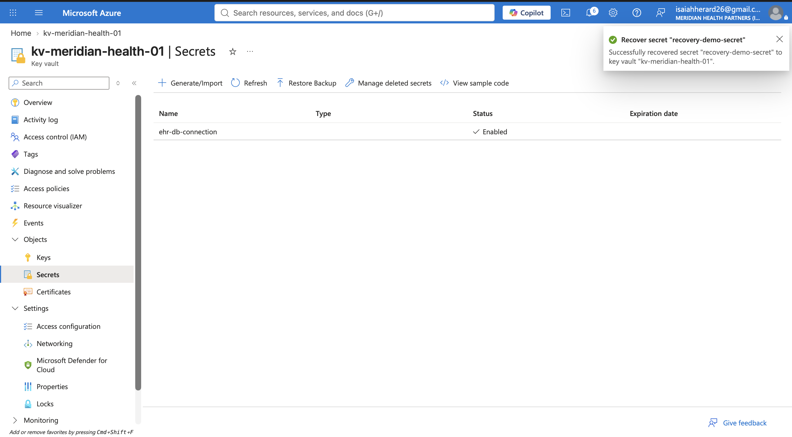

**Per-object backup** — an encrypted backup blob of the HSM key was exported. The blob is portable only within the same Azure geo/subscription; it is a recovery tool, not an exfiltration path.

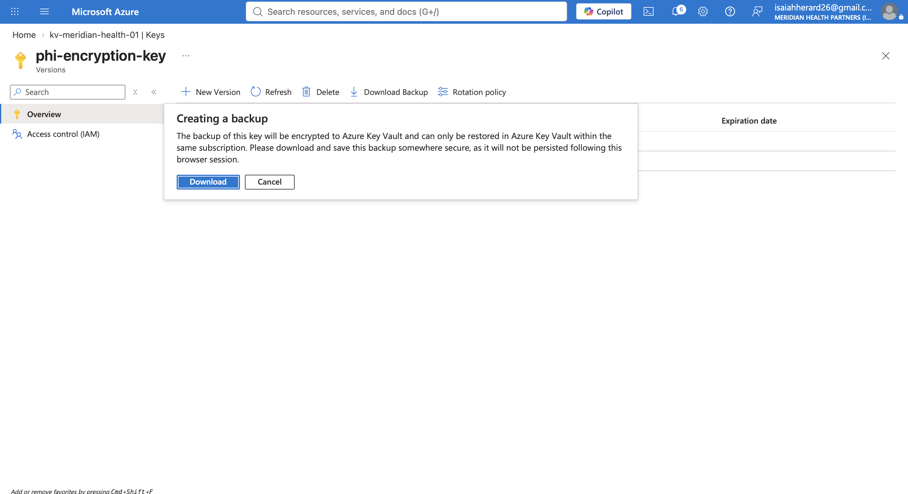

Together, soft-delete (reversible deletion) and purge protection (irreversible *destruction* is blocked) enforce **availability and integrity** — two HIPAA security pillars — at the platform level: neither an admin's fat-fingered delete nor an attacker's wipe attempt can cause permanent loss of the key that protects PHI.

---

## What Broke

Real issues, caught and remediated. These are preserved deliberately — validating and troubleshooting your own controls is the competence signal that separates hands-on work from a tutorial follow-along.

### 1. Azure Policy blocked the deployment (governance-in-depth)

A leftover subscription initiative, *"Governance – Tags & Allowed Types,"* included an **Allowed resource types** policy with a **Deny** effect that did not permit `Microsoft.KeyVault/vaults`.

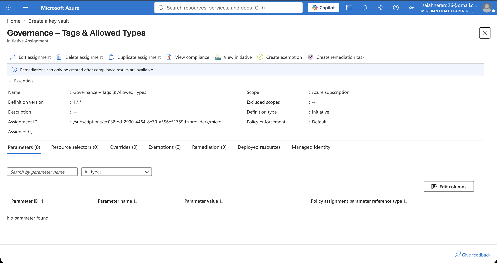

**Remediation (role-accurate):** rather than weakening the subscription-wide control, a **scoped policy exemption** (category *Waiver*, time-bound, with written justification) was issued for `rg-meridian-keyvault` and the Allowed-types rule only. The Deny stays enforced everywhere else.

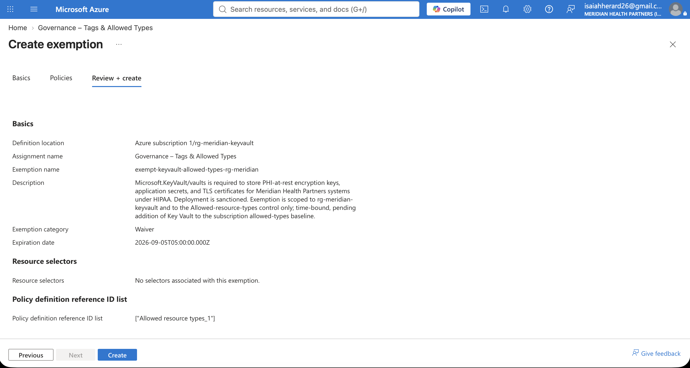

*Lesson:* the analyst's move is a narrow, documented, reversible waiver through an exception process — not a blanket disabling of the control. (Note: the Create blade cached a stale compliance preview; a full portal reload forced re-evaluation.)

### 2. Deployed Standard, needed Premium (immutable tier)

The vault was first deployed as **Standard**, which cannot create HSM-protected keys — leaving objective #2 unbuildable. The pricing tier is **immutable after creation**, so remediation required delete + redeploy as **Premium**. The empty vault made this cost-free; the resource group, policy exemption (scoped to the RG, not the vault), and all prior screenshots were preserved.

*Lesson:* verify SKU-gated capabilities against your objectives *before* deploying immutable settings.

### 3. RBAC control-plane ≠ data-plane

Creating the first secret failed with *"The operation is not allowed by RBAC."* Cause: **being Owner/Contributor on the resource does not grant data-plane access to secrets** — that separation is the RBAC feature this project chose over access policies. Remediation: an explicit **Key Vault data-plane role** was granted to the operating account.

*Lesson:* under Key Vault RBAC, control-plane ownership and data-plane access are deliberately distinct. Managing the vault is not the same right as reading its contents — by design.

---

## Skills demonstrated

- **IAM:** Azure RBAC data-plane authorization, per-object least-privilege scoping, role-vs-scope design, separation of duties, break-glass exclusion.
- **PAM / PIM:** just-in-time privileged access, eligible-vs-active assignments, zero standing privilege, activation with justification and time-boxing, privileged-role audit trails.
- **Secrets management:** lifecycle of secrets, keys, and certificates; HSM-protected key generation; native rotation and renewal; event-driven rotation architecture.
- **Cloud governance:** Azure Policy (initiatives, Deny effects), scoped exemptions/waivers through an exception process.
- **Resilience:** soft-delete, purge protection, per-object backup/recovery, control validation.
- **Compliance framing:** HIPAA / NIST SP 800-53 / ISO 27001 mapping of each control.

---

## Honest boundaries (documented, not hidden)

| Boundary | Lab approach | Production / enterprise answer |
|---|---|---|
| HSM assurance | Premium HSM keys (FIPS 140-2 **Level 2**) | Azure **Managed HSM** (Level 3, ~$2,300+/mo) |
| Secret rotation | Event-driven architecture **documented** | Deployed Function/runbook + Event Grid; or a PAM platform |
| PIM licensing | Single purchased Entra ID **P2** | P2 across all privileged principals |
| TLS certificate | Self-signed (identical vault lifecycle) | CA-integrated (publicly trusted) |

---

## Repository structure

```
iam-azure-key-vault-secrets-governance/
├── README.md
├── screenshots/          # 01–21, sequential build evidence
├── diagrams/
│   └── secret-rotation-architecture.svg
├── policies/             # exemption + RBAC assignment exports
└── docs/                 # extended architecture notes
```
